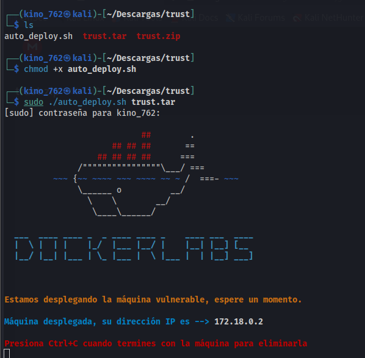
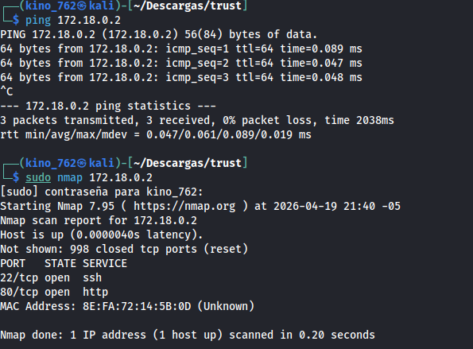
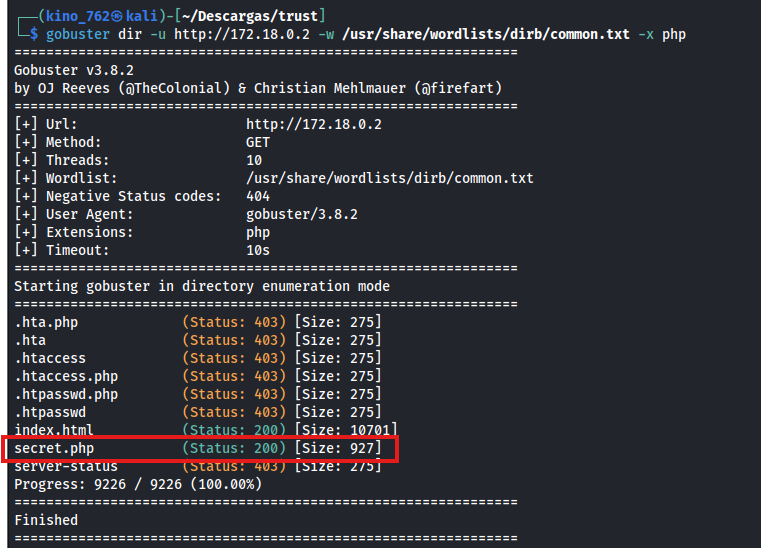
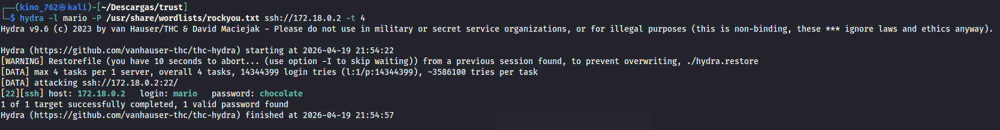
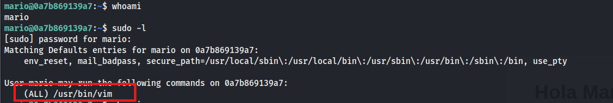
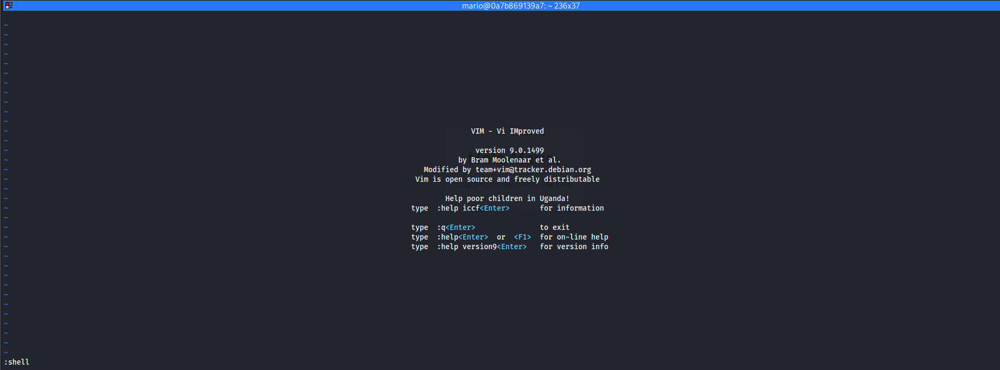
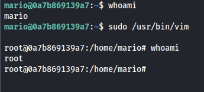

# 🗎 Informe de Análisis: Máquina Trust (DockerLabs)

Fecha: 17 de Abril, 2026

Máquina Vulnerada: **Trust**

Autor:**`Kino_762`**

### Descripción: 
Este informe técnico documenta el proceso de intrusión y compromiso total de la máquina objetivo. El análisis abarca desde la fase de reconocimiento y enumeración de servicios hasta la explotación de configuraciones inseguras, culminando con la escalada de privilegios y el control completo del sistema (root).

### Objetivos:
- Identificar los servicios expuestos y posibles vectores de entrada mediante el escaneo de red.
- Enumerar recursos web ocultos que proporcionen información crítica (usuarios o rutas).
- Obtener acceso inicial al sistema mediante técnicas de fuerza bruta sobre protocolos de administración remota.
- Escalar privilegios aprovechando configuraciones inseguras de sudo para tomar control total del servidor.
  
### Herramientas utilizadas:
- nmap: Utilizada para el descubrimiento de puertos abiertos y la identificación de servicios.
- gobuster: Empleada para el fuzzeo de directorios web.
- hydra: Utilizada para realizar el ataque de fuerza bruta.

### Metodología:
## A)PASO 1: "Ejecutar el laboratorio docker"
- Usamos le comando `chmod x+ autodeploy.sh` para otorgarle permisos.
- Ejecutamos el laboratorio usando el comando `sudo ./auto_deploy.sh` trust.tar.

## B)PASO 2: "comprobar la conexión y escaneo de puertos"
- Usamos el comando `ping 172.18.02` para comprobar la conexión.
- Para encontrar los puertos disponibles en la maquina usamos el comando `nmap 172.18.02`
- Deducimos que el puerto mas vulnerable en el tcp/80 http

## C)Paso 3: "Enumeración Web"
- Usamos el comando gobuster dir `-u http://172.18.0.2 -w /usr/share/wordlists/dirb/common.txt -x php`
- Este comando se utiliza para detectar para encontrar rutas ocultas.
- La imagen muestra que existe una direccio `secret.php`

## D)Paso 4:"Explotación"
- Como ya obtuvimos el nombre de usaurio Mario
- Procedemos a usar Hydra con el comando hydra -l mario -P /usr/share/wordlists/rockyou.txt ssh://172.18.0.2 -t 4
- Recordar que ya poseemos el username solo buscamos la contrasña

- Una vez obtenida la contraseña procedemos a acceder a la maquina desde ssh
- Credenciales obtenidas:
- Usuario: `mario`
- Contraseña: `chocolate`
- Usamos el comando ssh `mario@172.18.0.2 `y luego introducimos la contraseña

##· E)Paso 5:"Escalada de Privilegios"
- Ejecutamos `sudo -l` para ver qué comandos puede ejecutar el usuario con privilegios de superusuario sin necesidad de conocer la clave root
- Resultado: El usuario `mario` puede ejecutar `/usr/bin/vim` como cualquier usuario (ALL) sin restricciones

- Dado que vim permite ejecutar comandos de shell desde su interfaz, aprovechamos el privilegio de sudo para obtener una shell de root
- Usamos: `sudo /usr/bin/vim`

- Dentro de vim, entramos en el modo de comandos y ejecutamos:
- `:shell`

  

- Al ejecutar `whoami`, confirmamos que ahora somos root.

